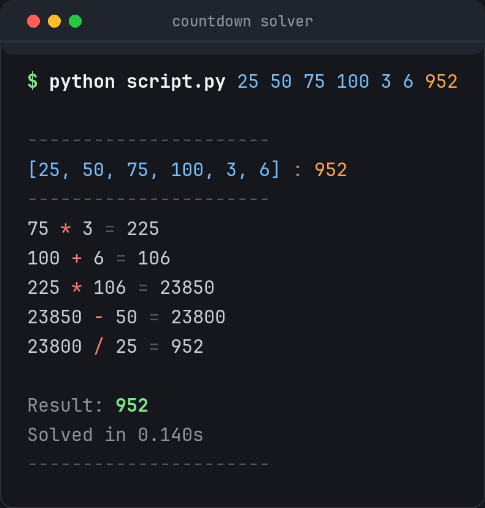

# Countdown numbers solver

Solves the numbers round from *8 Out of 10 Cats Does Countdown* — six numbers, a
three-digit target, and 30 seconds of Rachel Riley writing on a big glass board.

It searches every combination exhaustively, so if a solution exists it finds it,
and if none exists it tells you the closest you can get. A whole round takes
about a tenth of a second.

<p align="center">
  
</p>

## Running it

Python 3, no dependencies, nothing to install.

```console
$ python script.py 25 50 75 100 3 6 952   # six numbers, then the target
$ python script.py                        # or let it prompt you
$ python test_solver.py                   # run the tests
```

Every run is appended to `logfile.txt`.

## The rules it plays by

Countdown's arithmetic is stricter than a calculator's, and the solver sticks to it:

- Each number may be used **at most once** — and it is fine to leave some unused.
- Only `+`, `-`, `*` and `/`.
- **No fractions.** You may only divide when it comes out whole, so `100 / 4` is
  allowed and `100 / 3` is not.
- **No negatives or zero** at any point, not even in the middle of a working.

If the target simply cannot be made, you get the nearest reachable number instead,
which is what scores you the points on the show:

```console
$ python script.py 1 3 7 10 25 50 831
...
Result: 830 (off by 1)
```

## How it works

Take any two numbers, apply an operator, put the result back in the pool, and
repeat. Because the result rejoins the pool, two intermediate results can be
combined later — that is how bracketed solutions like `(4 * 3 - 1) * (25 * 2 + 1)`
are found without any special handling.

Searching that tree exhaustively is fast enough to be boring: identical states are
visited once, and pointless moves (multiplying or dividing by 1, subtracting a
number from itself) are skipped. The worst case — a target that cannot be made at
all, so the whole tree must be searched — finishes in about 0.1s.

The printed working shows only the steps that feed the answer, in the order you
would write them down.

## Tests

`python test_solver.py` — plain asserts, no framework needed, about a second.

The important one checks the solver against a deliberately naive brute force
across four games and every target from 1 to 400: each reachable target must be
hit exactly, and each unreachable one must return the genuinely closest value and
never a fabricated match. Every answer is also replayed step by step to confirm
the working only uses numbers actually available and adds up.

## A note on the old version

This started out as a random solver: shuffle the numbers, apply random operators,
repeat up to five million times and hope. It was fun, but it could only ever build
one long left-to-right chain, so bracketed solutions were unreachable no matter
how long it ran — as [#2](https://github.com/nicandris/8-10_does_countdown/issues/2)
pointed out. It also could not tell "no solution" from "did not find one yet".
